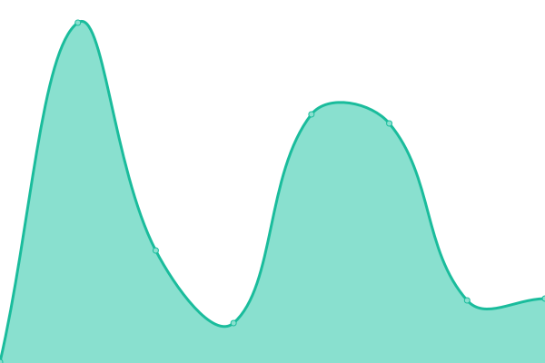
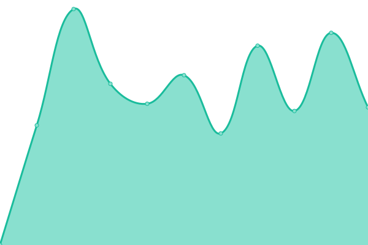
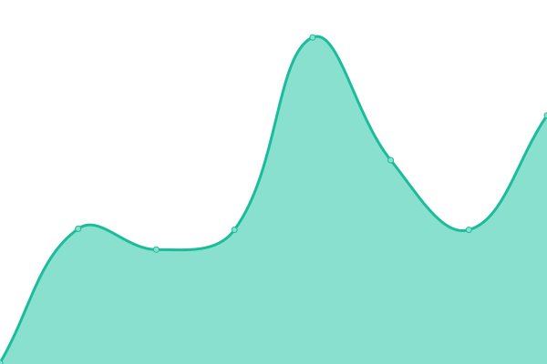
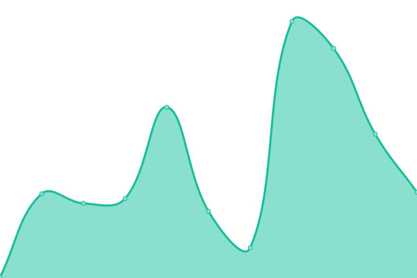
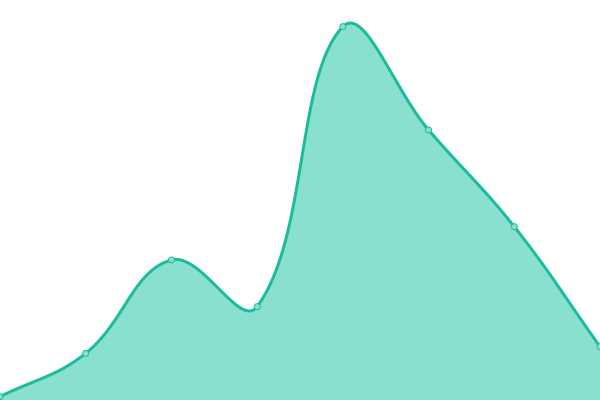
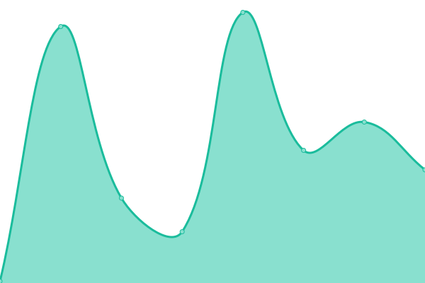

# [📈 Live Status](https://GeekCornerGH.github.io/helios-status-page): <!--live status--> **🟧 Partial outage**

This repository contains the open-source uptime monitor and status page for [GeekCorner](https://ytgeek.gq), powered by [Upptime](https://github.com/upptime/upptime).

With [Upptime](https://upptime.js.org), you can get your own unlimited and free uptime monitor and status page, powered entirely by a GitHub repository. We use [Issues](https://github.com/GeekCornerGH/helios-status-page/issues) as incident reports, [Actions](https://github.com/GeekCornerGH/helios-status-page/actions) as uptime monitors, and [Pages](https://GeekCornerGH.github.io/helios-status-page) for the status page.

<!--start: status pages-->
<!-- This summary is generated by Upptime (https://github.com/upptime/upptime) -->
<!-- Do not edit this manually, your changes will be overwritten -->
<!-- prettier-ignore -->
| URL | Status | History | Response Time | Uptime |
| --- | ------ | ------- | ------------- | ------ |
|  [Servicio multijugador de Mojang](http://session.minecraft.net) | 🟩 Up | [servicio-multijugador-de-mojang.yml](https://github.com/Clyzer/mangos-status-page/commits/HEAD/history/servicio-multijugador-de-mojang.yml) | 

 148ms
     
 | 

<a href="https://Clyzer.github.io/mangos-status-page/history/servicio-multijugador-de-mojang">100.00%</a>
    

|  [Minecraft Skins](https://textures.minecraft.net) | 🟩 Up | [minecraft-skins.yml](https://github.com/Clyzer/mangos-status-page/commits/HEAD/history/minecraft-skins.yml) | 

 155ms
     
 | 

<a href="https://Clyzer.github.io/mangos-status-page/history/minecraft-skins">100.00%</a>
    

|  [API pública de Mojang](https://api.mojang.com/) | 🟩 Up | [api-publica-de-mojang.yml](https://github.com/Clyzer/mangos-status-page/commits/HEAD/history/api-publica-de-mojang.yml) | 

 205ms
     
 | 

<a href="https://Clyzer.github.io/mangos-status-page/history/api-publica-de-mojang">100.00%</a>
    

|  [Sitio web de cuentas de Mojang](https://account.mojang.com/login) | 🟩 Up | [sitio-web-de-cuentas-de-mojang.yml](https://github.com/Clyzer/mangos-status-page/commits/HEAD/history/sitio-web-de-cuentas-de-mojang.yml) | 

 1280ms
     
 | 

<a href="https://Clyzer.github.io/mangos-status-page/history/sitio-web-de-cuentas-de-mojang">100.00%</a>
    

|  [Servidor Microsoft OAuth](https://login.microsoftonline.com/consumers/oauth2/v2.0/token) | 🟩 Up | [servidor-microsoft-o-auth.yml](https://github.com/Clyzer/mangos-status-page/commits/HEAD/history/servidor-microsoft-o-auth.yml) | 

 172ms
     
 | 

<a href="https://Clyzer.github.io/mangos-status-page/history/servidor-microsoft-o-auth">100.00%</a>
    

|  [Servidor de autenticación de Xbox Live](https://user.auth.xboxlive.com/user/authenticate) | 🟩 Up | [servidor-de-autenticacion-de-xbox-live.yml](https://github.com/Clyzer/mangos-status-page/commits/HEAD/history/servidor-de-autenticacion-de-xbox-live.yml) | 

 193ms
     
 | 

<a href="https://Clyzer.github.io/mangos-status-page/history/servidor-de-autenticacion-de-xbox-live">100.00%</a>
    

|  [Control de acceso a Xbox Live](https://xsts.auth.xboxlive.com/xsts/authorize) | 🟥 Down | [control-de-acceso-a-xbox-live.yml](https://github.com/Clyzer/mangos-status-page/commits/HEAD/history/control-de-acceso-a-xbox-live.yml) | 

 135ms
     
 | 

<a href="https://Clyzer.github.io/mangos-status-page/history/control-de-acceso-a-xbox-live">100.00%</a>
    

|  [Microsoft Minecraft API](https://api.minecraftservices.com/authentication/login_with_xbox) | 🟩 Up | [microsoft-minecraft-api.yml](https://github.com/Clyzer/mangos-status-page/commits/HEAD/history/microsoft-minecraft-api.yml) | 

 64ms
     
 | 

<a href="https://Clyzer.github.io/mangos-status-page/history/microsoft-minecraft-api">100.00%</a>
    

|  [Perfil de Microsoft Minecraft](https://api.minecraftservices.com/minecraft/profile) | 🟩 Up | [perfil-de-microsoft-minecraft.yml](https://github.com/Clyzer/mangos-status-page/commits/HEAD/history/perfil-de-microsoft-minecraft.yml) | 

 87ms
     
 | 

<a href="https://Clyzer.github.io/mangos-status-page/history/perfil-de-microsoft-minecraft">100.00%</a>
    

<!--end: status pages-->

[**Visit our status website →**](https://GeekCornerGH.github.io/helios-status-page)

## 📄 License

- Powered by: [Upptime](https://github.com/upptime/upptime)
- Code: [MIT](./LICENSE) © [GeekCorner](https://ytgeek.gq)
- Data in the `./history` directory: [Open Database License](https://opendatacommons.org/licenses/odbl/1-0/)
